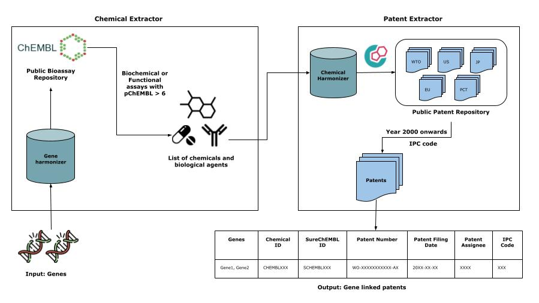

.. _intro:

.. _GitHub: https://github.com/Fraunhofer-ITMP/PEMT

Welcome to PEMT's documentation!
===================================
**Release notes** : https://github.com/Fraunhofer-ITMP/PEMT/releases

.. image:: ./logo.jpg
    :align: center

.. raw:: html

   <h1 align="center">
     
     
     
   </h1>

PEMT: A patent enrichment tool for drug discovery.
---------------------------------------------------------------------------------------------
PEMT takes a two-step approach to collect patent documents relevant for drug discovery.

1. The ``chemical_extractor`` module extraction of chemicals that directly regulate (i.e. activation or inhibition) genes of interest based on functional or biochemical assays found within ChEMBL.

2. The ``patent_extractor`` module interlinking these chemicals to patent documents by systematically querying SureChEMBL, a patent database.

General info
-------------
PEMT is a patent extractor tool that enables users to retrieve patents relevant to drug discovery. The framework is depicted in the graphic below

Installation
------------

You can install PEMT package from pypi.

.. code:: shell

   # Use pip to install the latest release
   $ python3 -m pip install pemt

You may instead want to use the development version from Github, by running

.. code:: shell

   $ python3 -m pip install git+https://github.com/Fraunhofer-ITMP/PEMT.git

For contributors, the repository can be cloned from `GitHub`_ and installed in editable mode using:

.. code:: shell

   $ git clone https://github.com/Fraunhofer-ITMP/PEMT.git
   $ cd PEMT
   $ python3 -m pip install -e .

Dependency
--------------
- Python 3.8+
- Installation of chromedriver

Mandatory
~~~~~~~~~

- Pandas
- CheMBL Webresource
- PubChemPy
- Chromedriver

For API information to use this library, see the :ref:`dev-guide`.

Issues
-------

If you have difficulties using PEMT, please open an issue at our `GitHub`_ repository.

Disclaimer
-----------

PEMT is a scientific tool that has been developed in an academic capacity, and thus comes with no warranty or guarantee of maintenance, support, or back-up of data.

